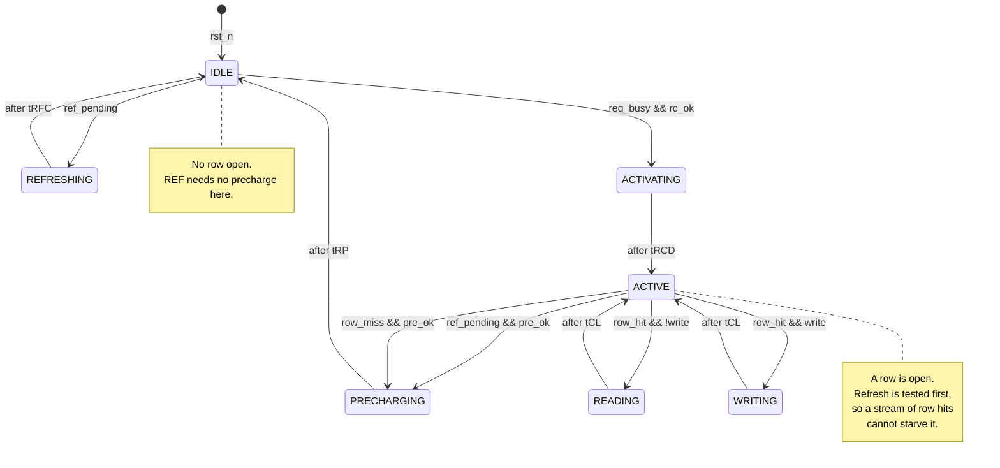

# Single-Bank DRAM Controller

A small, readable DDR4-style DRAM controller in Verilog, with a self-checking
testbench that independently verifies every timing constraint.

The point of the project is not the controller — it is the **checker**. A
controller that passes its own assumptions proves nothing, so the testbench
re-derives every timing rule from the command bus alone, and Stage 3 proves it
catches a real violation.

---

## What it does

- One DRAM bank, 8 rows × 16 columns, 32-bit data.
- Synchronous, active-low reset.
- **Open-page policy**: the row stays open after an access, so a request to the
  same row skips `ACT` entirely (row hit). A different row costs `PRE` + `ACT`
  (row miss).
- **Refresh has priority**: when `tREFI` expires the controller stops accepting
  new requests, finishes the access in flight, precharges if a row is open, and
  issues `REF`.
- All eight timing constraints are enforced as parameters in clock cycles.

---

## State diagram



`IDLE` means *no row is open*; `ACTIVE` means *a row is open and the controller
is otherwise idle*. Keeping those distinct is what makes the open-page decision
a single comparison in one state rather than a flag threaded through the FSM.

---

## Timing parameters

Defaults target **DDR4-2400**, `tCK ≈ 0.833 ns`. That speed bin is marketed as
**"17-17-17"**, and that label *is* `tCL-tRCD-tRP` in cycles — which is where
the first three values come from directly. The rest convert the JEDEC
nanosecond specification with `ceil(ns / tCK)`.

| Parameter | Cycles | ≈ ns | Constraint | Why the device needs it |
|---|---|---|---|---|
| `tRCD`  | 17   | 14.2 | ACT → RD/WR | Row charge must develop on the sense amps before a column can be read. |
| `tRP`   | 17   | 14.2 | PRE → ACT | Bitlines must be restored to Vdd/2 before another row is opened. |
| `tCL`   | 17   | 14.2 | RD → data | CAS latency: sense amp to output pin. |
| `tRAS`  | 39   | 32   | ACT → PRE | Reading a DRAM cell is destructive; the capacitors must be written back before the row may close. |
| `tRC`   | 56   | 46.6 | ACT → ACT | Full row cycle. Equals `tRAS + tRP` — not an independent number. |
| `tWR`   | 18   | 15   | write end → PRE | Write data must reach the capacitors before precharge. |
| `tRFC`  | 420  | 350  | REF → ACT/REF | Refresh cycle time for an 8 Gb device. Grows with density. |
| `tREFI` | 9360 | 7800 | average REF interval | 64 ms retention ÷ 8192 rows. |

`tRC = tRAS + tRP` is worth internalising: the row cycle is not a separate
constraint, it is the sum of "how long the row must stay open" and "how long
closing it takes".

---

## How to run

The toolchain is Icarus Verilog + GTKWave. On Ubuntu / WSL:

```bash
sudo apt install -y iverilog gtkwave
```

Then, from the project root:

```bash
make sim
```

```bash
make broken
```

```bash
make wave
```

```bash
make clean
```

- `make sim` — compile and run the self-checking testbench. Exits with
  `OVERALL: PASS`.
- `make broken` — run the **same** testbench against a deliberately bugged
  controller. Expected to report `OVERALL: FAIL`.
- `make wave` — open `sim/dram_ctrl.vcd` in GTKWave.

On Windows with the tools installed inside WSL, prefix any target:

```bash
wsl --exec bash -c "cd /mnt/c/Users/yusra/claude/dram-controller && make sim"
```

---

## Testbench structure

Three independent pieces live in `tb/tb_dram_ctrl.v`:

1. **Memory model.** Behaves like a real bank: it latches the row address when
   `ACT` is issued and indexes with the column at `RD`/`WR`. It never reads the
   controller's internal `open_row`, so a row-tracking bug surfaces as corrupted
   data instead of being masked.

2. **Timing checker.** Timestamps every command straight off the command bus and
   re-derives `tRCD`, `tRP`, `tRAS`, `tRC`, `tWR`, `tRFC` and the refresh
   deadline from scratch. It shares **no counter** with the DUT — that
   independence is what lets it disagree.

3. **Tests.** Write-then-read, row hit, row miss, back-to-back, refresh
   mid-access, and 500 randomized requests with a data scoreboard.

### Tests

| # | Test | Checks |
|---|---|---|
| 1 | Single write then read | Data integrity end to end |
| 2 | Row hit | No `ACT` issued for same-row access |
| 3 | Row miss | `PRE` then `ACT` both issued |
| 4 | 8 back-to-back requests | Only 2 `ACT`s across 16 accesses |
| 5 | Refresh mid-access | `REF` issues after the access drains |
| 6 | 500 randomized requests | All timing rules + data scoreboard |

Test 5 forces the condition deterministically by depositing a near-expiry value
into `dut.ref_ctr`, rather than simulating 9360 idle cycles and hoping the
overlap lands where it matters.

---

## Results

From `make sim`, measured over the 500-request randomized stream:

```
  row hit rate            : 77 / 500  = 15.4 %
  average latency         : 59.4 cycles
  cycles simulated        : 30267
  cycles refreshing       : 1260
  time spent refreshing   : 4.1 %
  worst REF-to-REF gap    : 9413 cycles (tREFI = 9360)

  commands: ACT=428 RD=272 WR=251 PRE=427 REF=4

  timing + data checks run : 2845
  failures                 : 0
  OVERALL: PASS
```

Reading the numbers:

- **Row hit rate 15.4%.** With 8 rows addressed uniformly at random, the chance
  the next request hits the open row is exactly `1/8 = 12.5%`. Measuring 15.4%
  confirms open-page captures the baseline and nothing more — a random stream
  has no spatial locality to exploit. Real workloads, with sequential addresses,
  do far better; this number is a floor, not a verdict on the policy.

- **Average latency 59.4 cycles**, split cleanly: **19 cycles on a hit**
  (`tCL` + handshake), **71 on a miss** (`tRAS` wait + `tRP` + `tRCD` + `tCL`).
  The 3.7× gap between them is the entire economic argument for open-page.

- **4.1% spent refreshing**, against a theoretical `tRFC/tREFI = 420/9360 =
  4.5%`. This is DRAM's fundamental refresh tax, and it worsens with capacity:
  `tRFC` grows with density while `tREFI` does not.

- **Worst REF-to-REF gap 9413 vs `tREFI` 9360** — 53 cycles late, matching the
  predicted worst case of `tCL + tWR + tRP ≈ 52`. Refresh is never starved.

### Stage 3: proving the checker works

`rtl/dram_ctrl_broken.v` is generated from the good controller with **exactly one
line changed** — `ACTIVATING` waits `tRCD-5` cycles instead of `tRCD`. The
testbench is untouched. Result:

```
  [FAIL] cycle 24: tRCD (ACT -> WR) -- measured 13, minimum 17
  ...
  failures                 : 426
  OVERALL: FAIL
```

426 failures, one per `ACT`, each naming the violated rule and the cycle.

Two things this demonstrates:

- **The data scoreboard still passed.** A functional-only testbench would have
  signed off on this chip. Timing violations don't corrupt a *simulation* —
  Verilog's memory array has no sense amps — they corrupt *silicon*. Closing
  that gap is the entire job of a timing checker.
- **Tests 2 and 4 still passed**, because pure row hits issue no `ACT` and
  therefore never exercise `tRCD`. Coverage is not the same as passing.

---

## Known characteristic: one cycle of conservatism

The checker measures `ACT → RD` as **18** cycles where `tRCD` is 17. The command
bus is registered one edge after the wait counter expires, so every intra-state
wait is one cycle longer than the minimum.

This never violates a constraint — it errs safe — but it leaves roughly one
cycle per `ACT` of bandwidth unused. Tightening `entry_load` from `tX - 1` to
`tX - 2` would close it. It is left as-is and documented rather than silently
changed, because the measured 18-vs-17 margin is what makes the Stage 3 result
legible.

---

## What I would add next

**Multiple banks.** The single biggest win available. Real DDR4 devices have 16
banks across 4 bank groups, and the entire point is overlap: `ACT` on bank 1
while bank 0 is still streaming data, hiding `tRCD` and `tRP` behind useful
work. This turns the controller from a sequencer into a scheduler and brings in
a new family of constraints that only exist *between* banks — `tRRD` (ACT to ACT
on different banks), `tFAW` (no more than four ACTs in any rolling window, a
power limit), and `tCCD_L/S` for bank-group turnaround. The FSM would become
per-bank state plus a shared arbiter.

**Closed-page policy comparison.** Auto-precharge right after each access, so
every request pays `tRCD` but none ever pays `tRP` on the critical path. Under
the random stream measured here — 15.4% hit rate — closed-page should *win*,
because the open row is nearly always wrong and the precharge is pure latency
added to the next miss. The crossover point is the interesting result: there is
a hit rate above which open-page wins, and deriving it from the measured hit and
miss latencies (19 and 71 cycles) and then confirming it in simulation would be
the real experiment. This is the cleanest next step, since the statistics
harness already exists.

**Then, in rough order of value:**

- **A request queue with reordering.** FR-FCFS (first-ready, first-come-first-
  served) — prioritise requests that hit an already-open row. This is what real
  memory controllers do, and it converts the hit rate from a property of the
  workload into a property of the scheduler.
- **Read/write turnaround penalties** (`tWTR`, `tRTW`). The shared data bus has
  to reverse direction, which is a real cost this model ignores.
- **Formal assertions.** The checks are procedural today; expressing them as
  SVA properties would let a formal tool prove `tRCD` can never be violated on
  *any* input sequence, rather than on the 500 sequences we happened to try.
- **Burst length > 1**, so `tCCD` and data-bus occupancy start to matter.

---

## Files

```
rtl/dram_ctrl.v          the controller
rtl/dram_ctrl_broken.v   one-line-bugged copy, for Stage 3
tb/tb_dram_ctrl.v        self-checking testbench
sim/                     build products and VCD (gitignored)
docs/README.md           this file
Makefile                 sim / broken / wave / clean
```
