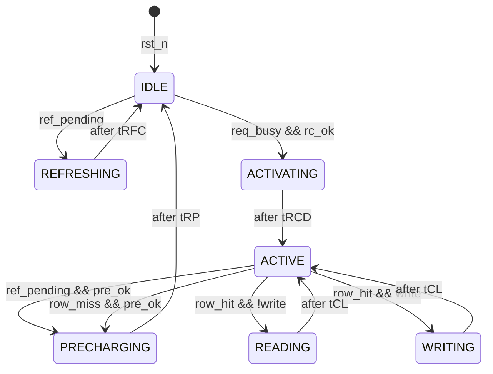
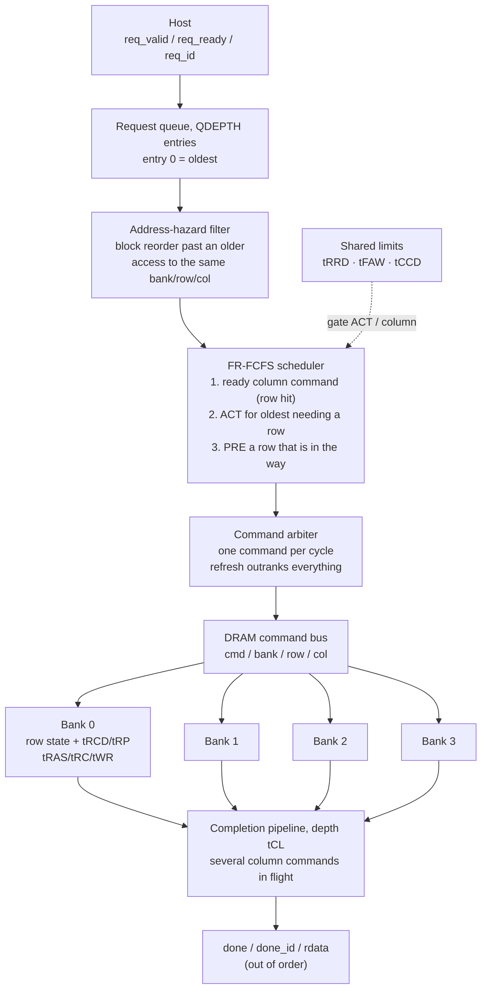

# DDR4 Memory Controller — Bank Parallelism & FR-FCFS Scheduling

A DDR4-class DRAM controller in Verilog, from a single-bank open-page FSM up to
a **4-bank controller with out-of-order FR-FCFS scheduling**, verified by a
testbench whose timing checker is fully independent of the design.

**Headline result: 3.95× throughput from bank parallelism plus scheduling — and
the sweep shows the scheduler, not the banks, is what does the work.**

| | |
|---|---|
| **Design** | Parameterised `NBANKS` × `QDEPTH` controller, open-page policy, 11 DDR4 timing constraints |
| **Verification** | Independent timing checker, out-of-order scoreboard, bug-injection proof, CI on every push |
| **Result** | 1.38× from banks alone → **3.95×** once a scheduler can exploit them → 7.29× at 8 banks |
| **Tools** | Icarus Verilog, GTKWave, GNU Make, GitHub Actions |

---

## Why this project is structured the way it is

A controller that passes its own assumptions proves nothing. Three deliberate
choices address that:

1. **The checker shares no counter with the design.** It timestamps commands off
   the command bus and re-derives every constraint itself, so it is *able* to
   disagree with the DUT.
2. **A deliberately bugged controller is kept in the repo and run by CI.** If the
   checker ever stops catching it, the build fails. A verification suite that
   silently weakens is worse than none.
3. **`NBANKS` and `QDEPTH` are parameters on one RTL source**, so the
   performance comparison runs an identical address stream through every
   configuration. Any difference in the numbers is attributable to the
   microarchitecture, not the workload.

---

## Results

### Configuration sweep — identical 500-request random stream

```
banks   queue       cycles    cyc/req    avg lat      worst   result
-----------------------------------------------------------------------
1       1            29180       58.4         75        496     PASS   1.00x
2       1            23603       47.2         64        523     PASS   1.24x
4       1            21192       42.4         59        510     PASS   1.38x
4       8             7395       14.8        134        380     PASS   3.95x
4       16            5563       11.1        190        496     PASS   5.25x
8       16            4004        8.0        140        402     PASS   7.29x
```

Reproduce with `make compare`.

**Bank parallelism without a scheduler is nearly worthless.** Going from 1 to 4
banks *in order* bought only **1.38×** — the other three banks sit idle because
an in-order controller still blocks on the head request and has nothing queued
to give them. Adding a queue of 8 to those **same four banks** jumped it to
**3.95×**. Banks supply the parallelism; the scheduler is what finds it.

**Latency and throughput move in opposite directions.** Average latency rises
from 59 cycles (in-order) to 134 (queue of 8) even as total time drops 2.9×.
That is Little's Law, not a bug: a deeper queue means more requests resident, so
each one waits longer while the system retires far more per cycle. Worst-case
latency actually *improves* (510 → 380), because the scheduler stops letting one
row miss block everything behind it.

**Every configuration passes the full timing checker**, `tRRD` and `tFAW`
included, so none of the speedup is bought by cheating on constraints.

### Single-bank baseline detail

```
  row hit rate            : 77 / 500  = 15.4 %
  average latency         : 59.4 cycles      (19 on a hit, 71 on a miss)
  time spent refreshing   : 4.1 %
  worst REF-to-REF gap    : 9413 cycles (tREFI = 9360)
  timing + data checks    : 2845          failures: 0
```

- **15.4% row hit rate.** With 8 rows addressed uniformly at random the
  probability of hitting the open row is exactly `1/8 = 12.5%`. Measuring 15.4%
  confirms open-page captures the baseline and nothing more — a random stream has
  no spatial locality to exploit. This is a floor, not a verdict on the policy.
- **19 vs 71 cycles, hit vs miss.** A hit is just `tCL`. A miss serialises three
  full device operations that physically cannot overlap: `tRP` → `tRCD` → `tCL`.
  That 3.7× gap is the entire economic argument for open-page.
- **4.1% spent refreshing** against a theoretical `tRFC/tREFI = 4.5%`. This is
  DRAM's fundamental refresh tax, and it worsens with density: `tRFC` grows with
  capacity while `tREFI` does not.

---

## Architecture

### Single-bank FSM



`IDLE` means *no row is open*; `ACTIVE` means *a row is open and the controller
is otherwise idle*. Keeping those distinct makes the open-page decision a single
comparison in one state rather than a flag threaded through the FSM.

### Multi-bank datapath and scheduler



Three things in that diagram are the actual engineering:

- **The scheduler's three passes are FR-FCFS.** Preferring a ready column
  command over a row command is the "first-ready" half; scanning the queue from
  the oldest entry is the "first-come-first-served" half.
- **The address-hazard filter is a correctness requirement, not an optimisation.**
  Without it the scheduler would happily hoist a read past a queued write to the
  same address and return stale data — a reordering bug a purely timing-focused
  checker would never see. It is why the scoreboard checks data as well as
  timing.
- **`tRRD` and `tFAW` gate the scheduler, not a bank.** They are shared-resource
  limits, and they are *power* limits rather than settling times: activating a
  row is the most current-hungry thing a DRAM does, so `tFAW` caps how much bank
  parallelism you are physically allowed to use.

---

## Timing parameters

Defaults target **DDR4-2400**, `tCK ≈ 0.833 ns`. That bin is marketed as
**"17-17-17"**, and the label *is* `tCL-tRCD-tRP` in cycles — which is where the
first three come from directly. The rest convert the JEDEC nanosecond spec with
`ceil(ns / tCK)`.

### Intra-bank

| Parameter | Cycles | ≈ ns | Constraint | Why the device needs it |
|---|---|---|---|---|
| `tRCD`  | 17   | 14.2 | ACT → RD/WR | Row charge must develop on the sense amps before a column can be read. |
| `tRP`   | 17   | 14.2 | PRE → ACT | Bitlines must be restored to Vdd/2 before another row opens. |
| `tCL`   | 17   | 14.2 | RD → data | CAS latency: sense amp to output pin. |
| `tRAS`  | 39   | 32   | ACT → PRE | Reading a DRAM cell is destructive; capacitors must be written back before the row may close. |
| `tRC`   | 56   | 46.6 | ACT → ACT (same bank) | Full row cycle. Equals `tRAS + tRP` — not an independent number. |
| `tWR`   | 18   | 15   | write end → PRE | Write data must reach the capacitors before precharge. |
| `tRFC`  | 420  | 350  | REF → ACT/REF | Refresh cycle time, 8 Gb device. Grows with density. |
| `tREFI` | 9360 | 7800 | average REF interval | 64 ms retention ÷ 8192 rows. |

### Inter-bank — only meaningful once banks exist

| Parameter | Cycles | ≈ ns | Constraint | Why |
|---|---|---|---|---|
| `tRRD` | 6  | 5  | ACT → ACT, different banks | **Power.** Spaces out the current spikes from opening rows. |
| `tFAW` | 26 | 21 | ≤ 4 ACTs per rolling window | **Power.** A hard ceiling on usable bank parallelism. |
| `tCCD` | 4  | 3.3| column → column | The data bus is busy. BL8 at double data rate = 4 cycles. |

`tRC = tRAS + tRP` is worth internalising: the row cycle is not a separate
constraint, it is "how long the row must stay open" plus "how long closing it
takes". Likewise, `tRRD` and `tFAW` being power limits explains why you cannot
simply add banks until the problem goes away.

---

## Verification

### Testbench structure

| Piece | What it does | Why it's built that way |
|---|---|---|
| Memory model | Latches the row at `ACT`, indexes with the column at `RD`/`WR`, per bank | Never reads the DUT's `bank_row`, so a row-tracking bug shows as corrupted data instead of being masked |
| Timing checker | Timestamps every command off the bus, re-derives all 11 constraints | Shares no counter with the DUT — that independence is what lets it disagree |
| Scoreboard | Matches completions by `id`, compares read data | Retirement is **out of order**, so an in-order scoreboard would not work at all |
| Driver | Keeps many requests outstanding | A one-at-a-time handshake would hide exactly the parallelism being built |

### Tests

| # | Test | Checks |
|---|---|---|
| 1 | Write then read back | Data integrity end to end |
| 2 | Row hit | No `ACT` issued for a same-row access |
| 3 | Row miss | `PRE` then `ACT` both issued |
| 4 | 8 back-to-back | Only 2 `ACT`s across 16 accesses |
| 5 | Refresh mid-access | `REF` issues after the access drains |
| 6 | 500 randomized | All timing rules + data scoreboard |
| 7 | Multi-bank sweep | 6 configurations, all constraints, out-of-order scoreboard |

Test 5 forces its condition deterministically by depositing a near-expiry value
into `dut.ref_ctr`, rather than simulating 9360 idle cycles and hoping the
overlap lands where it matters.

### Proving the checker actually works

`rtl/dram_ctrl_broken.v` is generated from the good controller with **exactly one
line changed** — `ACTIVATING` waits `tRCD-5` cycles instead of `tRCD`. The
testbench is untouched.

```
  [FAIL] cycle 24: tRCD (ACT -> WR) -- measured 13, minimum 17
  ...
  failures : 426        OVERALL: FAIL
```

426 failures, one per `ACT`, each naming the violated rule and the cycle. Two
things this demonstrates:

- **The data scoreboard still passed.** A functional-only testbench would have
  signed off on this chip. Timing violations don't corrupt a *simulation* —
  Verilog's memory array has no sense amps — they corrupt *silicon*. Closing that
  gap is the entire job of a timing checker.
- **Tests 2 and 4 still passed**, because pure row hits issue no `ACT` and so
  never exercise `tRCD`. Coverage is not the same as passing.

`make broken` **fails the build if the bug is *not* caught**, so this property is
regression-tested in CI rather than being a one-off demo.

---

## How to run

Toolchain is Icarus Verilog + GTKWave:

```bash
sudo apt install -y iverilog gtkwave
```

```bash
make all
```

| Target | Does |
|---|---|
| `make sim` | Single-bank controller + self-checking TB |
| `make mb` | Multi-bank + FR-FCFS controller (`NB=`, `QD=` override) |
| `make compare` | Configuration sweep table |
| `make broken` | Bug injection — fails the build if the bug escapes |
| `make all` | Everything that must pass, in order |
| `make wave` / `make wave-mb` | Open the VCD in GTKWave |
| `make clean` | Remove build products |

On Windows with the tools in WSL:

```bash
wsl --exec bash -c "cd /mnt/c/Users/yusra/claude/dram-controller && make all"
```

CI runs the whole suite on every push (`.github/workflows/ci.yml`), including
the assertion that the injected bug is still caught.

---

## Known characteristic: one cycle of conservatism

The checker measures `ACT → RD` as **18** cycles where `tRCD` is 17. The command
bus is registered one edge after the wait counter expires, so every intra-state
wait runs one cycle long.

This never violates a constraint — it errs safe — but it leaves roughly one
cycle per `ACT` unused. Tightening `entry_load` from `tX - 1` to `tX - 2` closes
it. Left as-is and documented rather than quietly changed, because the measured
18-vs-17 margin is what makes the bug-injection result legible.

---

## What I would add next

- **Closed-page policy comparison.** Auto-precharge after every access: each
  request pays `tRCD`, none pays `tRP` on the critical path. At the 15.4% hit
  rate measured here, closed-page should *win* — the open row is almost always
  wrong. The interesting result is the crossover hit rate, derivable from the
  measured 19/71-cycle hit and miss latencies and then confirmable in simulation.
  Cheapest next step, since the sweep harness already exists.
- **Bank groups.** DDR4 splits banks into groups with `tCCD_L` (6) within a group
  and `tCCD_S` (4) across. Address mapping then decides how well a stream spreads
  across groups, which is a real and measurable design knob.
- **Read/write turnaround** (`tWTR`, `tRTW`). The shared DQ bus must reverse
  direction; this model ignores that cost. Once modelled, a scheduler that
  *batches* reads and writes to amortise turnaround becomes worth building.
- **Formal assertions.** The checks are procedural. Expressed as SVA, a formal
  tool could prove `tRCD` is never violated on *any* input sequence, rather than
  on the sequences we happened to try.
- **Synthesis numbers.** Running Yosys for area and critical path would put a
  cost against each speedup in the sweep — the queue scan is the obvious timing
  suspect, and quantifying it is the honest way to defend `QDEPTH=8` over 16.

---

## Files

```
rtl/dram_ctrl.v           single-bank open-page controller
rtl/dram_ctrl_mb.v        multi-bank + FR-FCFS controller
rtl/dram_ctrl_broken.v    one-line-bugged copy, for the injection test
tb/tb_dram_ctrl.v         single-bank self-checking testbench
tb/tb_dram_ctrl_mb.v      multi-bank testbench, out-of-order scoreboard
sim/compare.sh            configuration sweep
.github/workflows/ci.yml  CI: all suites + bug-injection assertion
docs/README.md            this file
Makefile                  sim / mb / compare / broken / all / wave / clean
```
